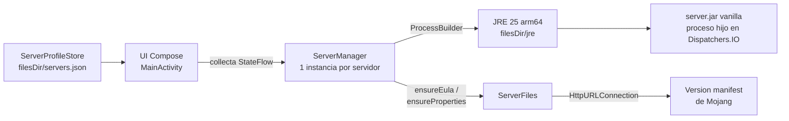

<div align="center">

# NomadServer

**Tu servidor de Minecraft Java, corriendo en tu propio teléfono.**

App nativa para Android que levanta un servidor *vanilla* de Minecraft Java con un JRE embebido —
sin root, sin PC encendida, sin suscripciones.


</div>

---

## Índice

- [Qué es](#qué-es)
- [Características](#características)
- [Requisitos](#requisitos)
- [Instalación](#instalación)
- [Uso rápido](#uso-rápido)
- [Cómo funciona](#cómo-funciona)
- [Roadmap](#roadmap)
- [Límites conocidos](#límites-conocidos)
- [Compilar desde el código](#compilar-desde-el-código)
- [Créditos](#créditos)

---

## Qué es

NomadServer descarga el **`server.jar` oficial de Mojang**, arranca un servidor de Minecraft Java
dentro del propio teléfono (con un JRE 25 embebido) y te deja unirte desde cualquier PC de la
misma red Wi-Fi con la dirección que la app muestra en pantalla.

> [!NOTE]
> La app **no está en Google Play**: ejecutar el JRE dentro de la app exige `targetSdk 28`, y Play
> exige 36. Se instala descargando la APK (*sideload*). Ver [Límites conocidos](#límites-conocidos).

---

## Características

- **Interfaz Compose** — panel con estado en tiempo real, consola y ajustes; tema claro/oscuro automático.
- **Varios servidores** — perfiles independientes, cada uno con su propio mundo, directorio y RAM asignada (1–4 GB).
- **Métricas reales** — RAM residente leyendo `/proc` (suma todos los JVMs del server) y jugadores conectados parseando `joined/left the game`.
- **Consola en vivo** — stdout+stderr del servidor, con botón para copiar todo el log al portapapeles.
- **IP LAN copiable** — prioriza Wi-Fi, con fallback a hotspot/datos; toca para copiar `<ip>:25565`.
- **Configuración automática** — `eula.txt` y `server.properties` se crean solos con valores conservadores (`view-distance=6`, `simulation-distance=4`, `white-list=false`).
- **Siempre actualizado** — descarga la última release estable desde el *version manifest* de Mojang.
- **Parada limpia** — envía `stop` por stdin y fuerza el cierre a los 10 s si no responde.

---

## Requisitos

| Requisito | Detalle |
|---|---|
| Sistema | Android 8.0 o superior (API 26+) |
| Arquitectura | **arm64-v8a** (el JRE embebido es arm64) |
| Almacenamiento | ~250 MB libres (JRE ~130 MB + `server.jar` + mundo) |
| Red | Internet la primera vez (descarga del `server.jar` desde Mojang; el JRE va dentro de la APK) |
| RAM | Recomendado un teléfono de 6 GB+; asigna 2–4 GB al server |

> [!IMPORTANT]
> Los jugadores solo pueden unirse desde la **misma red** que el teléfono (LAN). El acceso público
> desde internet está en el [Roadmap](#roadmap) (Fase 5).

---

## Instalación

1. Obtén la APK: compílala con `./gradlew :app:assembleDebug` (la APK resultante queda en
   `app/build/outputs/apk/debug/app-debug.apk`) y cópiala al teléfono.
2. En el teléfono, abre la APK y activa **«Instalar apps de este origen desconocido»** cuando lo pida.
3. Abre NomadServer y crea tu primer servidor.

> [!TIP]
> La **primera vez que pulsas START** tarda unos minutos: se extrae el JRE (~130 MB) y se descarga
> el `server.jar`. Después los arranques son rápidos.

---

## Uso rápido

1. Toca el botón **+** y crea un servidor (nombre + RAM asignada).
2. Pulsa **START** y espera a que la consola diga `Done`.
3. En la pestaña **Panel**, copia la IP que aparece en *Conexión*.
4. Abre Minecraft Java en tu PC → *Multijugador* → *Conectar a un servidor* → pega `IP:25565`.
5. **STOP** detiene el server guardando el mundo; el mundo se conserva aunque cierres la app.

> [!TIP]
> ¿Algo falla? Abre **Consola** y toca **Copiar**: el log completo es lo primero que se necesita
> para diagnosticar. Para un servidor 24/7 real sin depender del teléfono, el contenido de
> `files/servers/<id>/` es portable: llévalo a un PC o VPS con Java 25 y arranca
> `java -jar server.jar nogui`.

---

## Cómo funciona



- **`NomadApplication`** crea un `ServerManager` por perfil y lo mantiene durante toda la vida de la app.
- **`ServerManager`** lanza el JVM como proceso separado, captura sus logs y expone `status`,
  `logs`, `ramUsedMb` y `players` como `StateFlow` que la UI recolecta.
- **`JreInstaller`** extrae `assets/jre.zip` una sola vez y restaura los bits de ejecución de
  `bin/*` (los ZIP no guardan permisos).
- **Stack**: Kotlin · Jetpack Compose + Material 3 · coroutines/StateFlow · Gradle 9.6 + AGP 9.4.1 ·
  sin dependencias de red externas (`HttpURLConnection` + `org.json` incluido en Android).

---

## Roadmap

| Fase | Estado | Descripción |
|:---:|:---:|---|
| 1 | OK | **Base** — proyecto Gradle/AGP 9, UI Compose con panel, consola y ajustes |
| 2 | OK | **Motor** — JRE 25 embebido, descarga de `server.jar`, eula/properties automáticos |
| 3 | OK | **Multi-servidor y métricas** — perfiles, RAM real vía `/proc`, jugadores, IP LAN copiable |
| 4 | Pendiente | **Foreground service** — el server sobrevive en segundo plano y con la pantalla apagada |
| 5 | Pendiente | **Túnel Playit.gg** — acceso público desde cualquier red, sin abrir puertos en el router |
| 6 | Pendiente | **World border y ajustes avanzados** — los controles visibles en *Ajustes* dejan de ser decorativos |

> [!WARNING]
> Hasta la **Fase 4**, Android puede matar el proceso si la app pasa a segundo plano. Mientras
> tanto, mantén NomadServer abierta (o la pantalla encendida) si quieres que el server siga vivo.

---

## Límites conocidos

> [!CAUTION]
> **No subir `targetSdk` de 28.** Desde API 29, Android prohíbe `exec()` de archivos en el
> directorio privado de la app (W^X), y NomadServer ejecuta el `java` del JRE desde `filesDir`.
> Cambiarlo rompería el lanzamiento del servidor por completo. Como efecto secundario, la app no
> puede publicarse en Google Play (exige targetSdk 36).

Además:

- **Vanilla solamente** — no hay soporte de mods ni plugins (Fabric/Forge/Paper no están en el roadmap cercano).
- **Sin 24/7 garantizado desde el móvil** — depende de la luz, el Wi-Fi y la batería del dispositivo; para un server siempre online usa un equipo externo (ver [Uso rápido](#uso-rápido)).
- **Una APK ≈ 60 MB** — el JRE va dentro comprimido; es el precio de no depender de nada externo.
- **Solo un proceso por perfil** — arrancar dos perfiles a la vez es posible pero comparten el mismo JRE y la RAM que les asignes.

---

## Compilar desde el código

```sh
./gradlew :app:assembleDebug          # APK debug
./gradlew :app:testDebugUnitTest      # tests JVM
./gradlew :app:lint                   # lint (0 errores)
./scripts/prepare-jre.sh              # regenera assets/jre.zip
```

> [!IMPORTANT]
> Un *clone* fresco **no compila ni arranca tal cual**:
> 1. `local.properties` es *gitignored* → crea apuntando a tu SDK (`sdk.dir=...`).
> 2. `app/src/main/assets/jre.zip` también es *gitignored* → coloca un
>    `jre25-android-arm64.tar.xz` en `jre/` y ejecuta `scripts/prepare-jre.sh`
>    (requiere `bsdtar` y el NDK para `libc++_shared.so`).
>
> Sin eso, la app construye pero falla al iniciar el servidor.

<details>
<summary><b>Estructura del proyecto</b></summary>

```
app/src/main/java/com/eljuliodev/servidormc/
├── MainActivity.kt          # UI completa (Compose): lista, panel, consola, ajustes
├── NomadApplication.kt      # contenedor de los ServerManager
├── ServerManager.kt         # proceso del server + StateFlows
├── ServerFiles.kt           # eula, server.properties, descarga del server.jar
├── ServerProfileStore.kt    # perfiles en filesDir/servers.json
├── JreInstaller.kt          # extracción de assets/jre.zip
└── LanAddress.kt            # IP LAN (Wi-Fi primero, si no cualquier IPv4 privada)
scripts/prepare-jre.sh       # empaqueta el JRE en assets/jre.zip
```
</details>

---

## Créditos

- **JRE Android arm64**: [AngelAuraMC/angelauramc-openjdk-build](https://github.com/AngelAuraMC/angelauramc-openjdk-build) — builds de OpenJDK para Android.
- **`server.jar` oficial**: [Mojang](https://www.minecraft.net/en-us/download/server) — descargado desde su *version manifest* en tiempo de ejecución.
