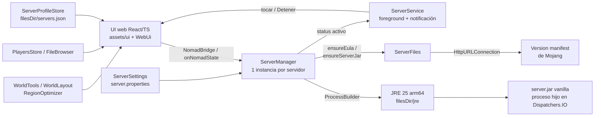

<div align="center">

# NomadServer

**Tu servidor de Minecraft Java, corriendo en tu propio teléfono.**

App Android que levanta un servidor *vanilla* de Minecraft Java con un JRE embebido —
sin root, sin PC encendida, sin suscripciones. La interfaz es web (React + TypeScript) dentro de
un WebView; el motor del servidor es Kotlin.


</div>

---

## Índice

- [Qué es](#qué-es)
- [Características](#características)
- [Requisitos](#requisitos)
- [Instalación](#instalación)
- [Uso rápido](#uso-rápido)
- [Cómo funciona](#cómo-funciona)
- [Roadmap](#roadmap)
- [Próximas funciones](#próximas-funciones)
- [Límites conocidos](#límites-conocidos)
- [Compilar desde el código](#compilar-desde-el-código)
- [Créditos](#créditos)

---

## Qué es

NomadServer descarga el **`server.jar` oficial de Mojang**, arranca un servidor de Minecraft Java
dentro del propio teléfono (con un JRE 25 embebido) y te deja unirte desde cualquier PC de la
misma red Wi-Fi con la dirección que la app muestra en pantalla.

La app se maneja como un **panel administrativo**: crear servidores, encender/apagar/reiniciar,
leer la consola y enviar comandos, gestionar jugadores (OP, kick, ban, lista blanca), ver y
optimizar el mundo, explorar los archivos del servidor y editar sus ajustes.

> [!NOTE]
> La app **no está en Google Play**: ejecutar el JRE dentro de la app exige `targetSdk 28`, y Play
> exige 36. Se instala descargando la APK (*sideload*). Ver [Límites conocidos](#límites-conocidos).

---

## Características

**Servidores**

- **Varios servidores** — perfiles independientes, cada uno con su propio mundo, directorio e
  icono; la RAM asignada (1–4 GB) se guarda en el perfil.
- **Versión elegible** — al crear se elige la versión vanilla (solo releases **1.17+**, las que
  corre el JRE 25 embebido) desde el *version manifest* de Mojang, con buscador. Se puede
  cambiar después desde *Ajustes* (se descarga al siguiente arranque).
- **Icono y descripción** — sube un `server-icon.png` de 64x64 (se recorta solo) y edita la
  descripción (MOTD) con **formato de Minecraft**: paleta de 16 colores y negrita, cursiva,
  subrayado, tachado y "glitch" (`§l`, `§o`, `§n`, `§m`, `§k`, `§r`), con vista previa.
- **Configuración automática** — `eula.txt` y `server.properties` se crean solos con valores
  conservadores para móvil (`view-distance=6`, `simulation-distance=4`, `white-list=false`).

**Panel y control**

- **Métricas reales** — RAM residente leyendo `/proc` (suma todos los JVMs del server), CPU en % del
  dispositivo (delta de ticks de `/proc/<pid>/stat`, normalizado por núcleos), jugadores
  conectados parseando `joined/left the game`, TPS estimado desde el log e IP LAN copiable.
- **Arranque con progreso** — barra de porcentaje ("Preparing spawn area"), campanita al terminar
  de encender y aviso de "en línea" solo cuando el log dice `Done (`.
- **Apagado por inactividad** — si nadie entra en 2 minutos, el servidor se apaga solo; el
  contador se puede prolongar con **+1 minuto**.
- **Detener y reiniciar** — botones separados; el reinicio reusa el `finally` del proceso.
- **Segundo plano** — un servicio en primer plano mantiene el servidor vivo aunque cierres la app
  o cambies a otra; una notificación fija muestra el icono, el nombre y los jugadores, con un
  botón **Detener** al desplegarla. No se puede descartar deslizándola (solo desaparece al apagar
  el servidor) y al tocarla abre el **panel** de ese servidor.
- **Parada limpia** — envía `stop` por stdin y fuerza el cierre a los 10 s si no responde.

**Consola**

- **Entrada de comandos** con historial (flechas arriba/abajo), eco local y botón de enviar.
- **Colores por tipo de línea**: chat de jugadores, mensajes de `[Server]` (`/say`), logros,
  conexiones, warnings y errores.

**Jugadores**

- **En línea** con cabeza y tres acciones por jugador: **OP/deOP**, **Kick** y **Ban** (con
  motivo opcional y confirmación). Todo por comando, sin apagar el servidor.
- **Lista blanca** (activar, añadir, quitar) e **IPs baneadas** y **jugadores baneados** con
  botón para desbanear.

**Mundo**

- **Semilla** — con el servidor encendido la pide con `/seed`; apagado la lee de `level.dat`.
- **Espacio** — desglose por dimensión (Mundo, Nether, End), `server.jar` y logs, con número de
  archivos, más el **almacenamiento real del dispositivo** (usado/total y aviso si quedan < 1 GB).
- **Regenerar Nether/End** e **importar mundo desde `.zip`** (con `level.dat`, protección
  antizip-slip y comprobación de espacio libre).
- **Optimizador** — en modo **Compactar** (seguro: reempaqueta las regiones sin quitar nada) o
  **Quitar sin visitar** (avanzado: elimina chunks nunca visitados y logs viejos), siempre con
  vista previa del espacio a liberar.

**Archivos**

- **Explorador de solo lectura** de todo el directorio del servidor (mundo, dimensiones, logs,
  archivos de configuración, etc.), con navegación por carpetas y tamaños.

**Ajustes**

- **`server.properties` real**: slots, modo de juego, dificultad, vuelo (`allow-flight`), lista
  blanca, "cracked" (`online-mode`), protección del spawn, MOTD, icono y las **distancias de
  visión y simulación** (chunks), que son la palanca de rendimiento más directa.
- Se **bloquea con el servidor encendido** (Minecraft reescribe el archivo al detenerse).

**Compatibilidad**

- **Layout de mundo** — soporta el guardado clásico (`world/region`) y el de **Minecraft 26.1+**
  (`world/dimensions/minecraft/<dimensión>/region`) para tamaños, regenerar, semilla y
  optimizador.

---

## Requisitos

| Requisito | Detalle |
|---|---|
| Sistema | Android 8.0 o superior (API 26+) |
| Arquitectura | **arm64-v8a** (el JRE embebido es arm64) |
| Almacenamiento | ~250 MB libres (JRE ~130 MB + `server.jar` + mundo) |
| Red | Internet la primera vez (descarga del `server.jar` desde Mojang; el JRE va dentro de la APK) |
| RAM | Recomendado un teléfono de 6 GB+; asigna 2–4 GB al server |

> [!IMPORTANT]
> Los jugadores solo pueden unirse desde la **misma red** que el teléfono (LAN). El acceso público
> desde internet está en el [Roadmap](#roadmap).

---

## Instalación

1. Obtén la APK: compílala con `./gradlew :app:assembleDebug` (la APK resultante queda en
   `app/build/outputs/apk/debug/app-debug.apk`) y cópiala al teléfono.
2. En el teléfono, abre la APK y activa **«Instalar apps de este origen desconocido»** cuando lo pida.
3. Abre NomadServer y crea tu primer servidor.

> [!TIP]
> La **primera vez que pulsas Iniciar** tarda unos minutos: se extrae el JRE (~130 MB) y se descarga
> el `server.jar`. Después los arranques son rápidos.

---

## Uso rápido

1. Toca el botón **+**, ponle nombre, elige la **versión** y, si quieres, el icono y los ajustes.
   Pulsa **Crear**.
2. Pulsa **Iniciar** y espera a ver **En línea** (y la campanita).
3. En **Panel**, copia la IP de la tarjeta superior.
4. Abre Minecraft Java en tu PC → *Multijugador* → *Conectar a un servidor* → pega `IP:25565`.
5. **Detener** guarda el mundo; se conserva aunque cierres la app o apagues el teléfono.

Las pestañas de la barra inferior (solo iconos) son: **Panel · Consola · Jugadores · Mundo ·
Archivos · Ajustes**.

> [!TIP]
> ¿Algo falla? Abre **Consola** y toca **Copiar**: el log completo es lo primero que se necesita
> para diagnosticar. Para un servidor 24/7 real sin depender del teléfono, el contenido de
> `files/servers/<id>/` es portable: llévalo a un PC o VPS con Java 25 y arranca
> `java -jar server.jar nogui`.

---

## Cómo funciona



- **`NomadApplication`** crea un `ServerManager` por perfil y lo mantiene durante toda la vida de la app.
- **`ServerManager`** lanza el JVM como proceso separado, captura sus logs y expone `status`,
  `logs`, `ramUsedMb`, `players`, `tps`, `startProgress`, `seed` y `autoStopSeconds` como `StateFlow`.
- **`WebUi`** sirve la UI web (`app/src/main/assets/ui`) con `WebViewAssetLoader` y traduce el
  estado a un `snapshot` JSON que la web consume (el log viaja en deltas, no entero); de vuelta
  recibe las acciones por `window.NomadBridge`. No construye ni empuja nada mientras la app está
  en segundo plano.
- **`ServerFiles`** crea `eula.txt` / `server.properties` y descarga el `server.jar` de la versión
  elegida (manifest cacheado en memoria y en disco).
- **`ServerSettings`** lee y escribe `server.properties` conservando claves ajenas.
- **`WorldTools` / `WorldLayout`** calculan tamaños, resuelven el layout del mundo, regeneran
  dimensiones, importan `.zip` y leen la semilla; **`RegionOptimizer`** reempaqueta las regiones y,
  opcionalmente, quita chunks nunca visitados.
- **`PlayersStore` / `FileBrowser`** leen listas de jugadores y el directorio del servidor.
- **`ServerService`** es un servicio en primer plano que se inicia cuando un servidor pasa a
  activo y se detiene cuando se apaga; mantiene vivo el proceso en segundo plano y publica la
  notificación (icono, nombre, jugadores, acción **Detener** y apertura del panel al tocarla).
- **`JreInstaller`** extrae `assets/jre.zip` una sola vez y restaura los bits de ejecución de
  `bin/*` (los ZIP no guardan permisos).
- **Stack**: Kotlin + coroutines/StateFlow · React 19 + TypeScript + Tailwind CSS 4 (Vite) ·
  Gradle 9.6 + AGP 9.4.1 · sin dependencias de red externas
  (`HttpURLConnection` + `org.json` incluido en Android).

---

## Roadmap

| Fase | Estado | Descripción |
|:---:|:---:|---|
| 1 | OK | **Base** — proyecto Gradle/AGP 9, UI web (React/TS) con panel, consola y ajustes |
| 2 | OK | **Motor** — JRE 25 embebido, descarga de `server.jar`, eula/properties automáticos |
| 3 | OK | **Multi-servidor y métricas** — perfiles, RAM real vía `/proc`, jugadores, IP LAN copiable |
| 4 | OK | **Ajustes reales** — `server.properties` completo, icono 64x64 y descripción (MOTD con `§`) |
| 5 | OK | **Versión elegible** — elegir la versión al crear y cambiarla desde Ajustes |
| 6 | OK | **Jugadores** — OP/deOP, kick, ban (con motivo), lista blanca e IPs/jugadores baneados |
| 7 | OK | **Mundo** — semilla, espacio por dimensión, regenerar Nether/End, importar `.zip` |
| 8 | OK | **Archivos y optimizador** — explorador de solo lectura y optimización con vista previa |
| 9 | OK | **Segundo plano** — servicio en primer plano con notificación (nombre, jugadores y Detener) |
| 10 | Pendiente | **Túnel Playit.gg** — acceso público desde cualquier red, sin abrir puertos en el router |
| 11 | Pendiente | **World border** — control del borde de mundo desde Ajustes |
| 12 | Pendiente | **Backups** — copia del mundo antes de operaciones destructivas |
| 13 | Pendiente | **Fabric y mods** — loader Fabric e instalación desde Modrinth (CurseForge después) |

> [!NOTE]
> Con el servidor encendido, Android muestra una **notificación fija** (no se puede descartar)
> mientras corre: es lo que mantiene el proceso vivo en segundo plano. Se quita sola al detener
> el servidor.

---

## Próximas funciones

Lo que todavía **no** está implementado y se planea:

- **Túnel Playit.gg** — jugar con amigos de otras redes sin abrir puertos.
- **World border** — fijar el borde del mundo desde *Ajustes*.
- **Backups** — copia del mundo antes de regenerar, importar u optimizar. Hoy esas acciones
  avisan de que son irreversibles.
- **Fabric y mods** — soporte del loader Fabric e instalación de mods desde **Modrinth**
  (búsqueda, versiones compatibles, dependencias). **CurseForge** queda después: exige que el
  usuario pegue su propia API key y muchos mods no permiten descarga directa.
- **Jugadores con el servidor apagado** — editar `whitelist.json`/`ops.json` sin encender el
  server (requiere resolver el UUID contra la API de Mojang, con cola y backoff por el rate
  limit).
- **Versiones antiguas (≤ 1.16.5)** — necesitan Java 8; implicaría empaquetar un segundo JRE.
- **Ban por IP desde el mismo panel** ya existe; falta **ban temporal** (con caducidad).
- **Selector de versión con "mostrar snapshots"** — hoy solo se ofrecen releases estables.

---

## Límites conocidos

> [!CAUTION]
> **No subir `targetSdk` de 28.** Desde API 29, Android prohíbe `exec()` de archivos en el
> directorio privado de la app (W^X), y NomadServer ejecuta el `java` del JRE desde `filesDir`.
> Cambiarlo rompería el lanzamiento del servidor por completo. Como efecto secundario, la app no
> puede publicarse en Google Play (exige targetSdk 36).

Además:

- **Vanilla solamente** — todavía no hay soporte de mods ni plugins (Fabric está en el roadmap).
- **Versiones 1.17+** — el JRE embebido es Java 25; las versiones muy antiguas no arrancan en él.
- **Sin backups** — regenerar, importar u optimizar avisan de que son irreversibles.
- **Optimizador "quitar sin visitar"** — heurístico: conserva todo chunk con `InhabitedTime > 0`
  (los que tuvieron jugadores), y borra los nunca visitados, que Minecraft regenera igual desde la
  semilla. La distancia no influye. Excepción: cambios hechos sin habitar el chunk (comandos,
  editores externos) podrían perderse; el modo **Compactar** no borra nada.
- **TPS estimado** — vanilla no expone TPS real; el valor es una aproximación desde el log.
- **Consumo y calor** — el gasto lo domina el propio Minecraft, no la app: con la UI en segundo
  plano ésta no sondea RAM ni arma la interfaz, y el JRE arranca con `SerialGC` (menos CPU que G1).
  La palanca más efectiva son las distancias de visión/simulación, ajustables en *Ajustes*.
- **Sin 24/7 garantizado desde el móvil** — depende de la luz, el Wi-Fi y la batería; para un
  server siempre online usa un equipo externo (ver [Uso rápido](#uso-rápido)).
- **Una APK ≈ 60 MB** — el JRE va dentro comprimido; es el precio de no depender de nada externo.
- **Solo un proceso por perfil** — arrancar dos perfiles a la vez es posible pero comparten el
  mismo JRE y la RAM que les asignes.

---

## Compilar desde el código

```sh
./gradlew :app:assembleDebug          # APK debug
./gradlew :app:testDebugUnitTest      # tests JVM
./gradlew :app:lint                   # lint (0 errores)
./scripts/prepare-jre.sh              # regenera assets/jre.zip
npm --prefix web install              # dependencias de la UI (una vez)
npm --prefix web run dev              # diseña la UI en el navegador (datos simulados)
npm --prefix web run build            # UI -> app/src/main/assets/ui (commiteado)
```

La UI vive en `web/` (Vite + React + TypeScript). El resultado de `npm run build` se commitea en
`app/src/main/assets/ui/`, así que la APK se compila **sin Node**; sólo reconstruye la UI cuando la
cambies.

> [!IMPORTANT]
> Un *clone* fresco **no compila ni arranca tal cual**:
> 1. `local.properties` es *gitignored* → crea apuntando a tu SDK (`sdk.dir=...`).
> 2. `app/src/main/assets/jre.zip` también es *gitignored* → coloca un
>    `jre25-android-arm64.tar.xz` en `jre/` y ejecuta `scripts/prepare-jre.sh`
>    (requiere `bsdtar` y el NDK para `libc++_shared.so`).
>
> Sin eso, la app construye pero falla al iniciar el servidor.

<details>
<summary><b>Estructura del proyecto</b></summary>

```
app/src/main/java/com/eljuliodev/servidormc/
├── MainActivity.kt          # Activity: monta el WebView y el botón "atrás"
├── WebUi.kt                 # sirve assets/ui y hace de puente UI <-> StateFlow
├── NomadApplication.kt      # contenedor de los ServerManager
├── ServerManager.kt         # proceso del server + StateFlows (estado, logs, RAM, CPU, TPS...)
├── ServerFiles.kt           # eula, server.properties, versiones y descarga del server.jar
├── ServerSettings.kt        # lectura/escritura de server.properties e icono 64x64
├── ServerProfileStore.kt    # perfiles en filesDir/servers.json
├── PlayersStore.kt          # ops.json / whitelist.json / banned-*.json
├── WorldTools.kt            # tamaños, regenerar, importar .zip, semilla, optimizador
├── WorldLayout.kt           # layout del mundo (clásico y 26.1+)
├── RegionOptimizer.kt       # reempaqueta .mca y quita chunks sin visitar
├── FileBrowser.kt           # explorador de archivos del servidor
├── Nbt.kt                   # lector NBT mínimo (semilla, InhabitedTime)
├── JreInstaller.kt          # extracción de assets/jre.zip
└── LanAddress.kt            # IP LAN (Wi-Fi primero, si no cualquier IPv4 privada)
web/                         # UI: Vite + React + TypeScript + Tailwind (fuente)
├── src/bridge.ts            # puente con Kotlin + mock para diseñar en el navegador
├── src/screens.tsx          # lista, panel, consola, jugadores, mundo, archivos, ajustes
└── src/sound.ts             # campanita (WebAudio)
app/src/main/assets/ui/      # UI compilada (generada por `npm run build`)
scripts/prepare-jre.sh       # empaqueta el JRE en assets/jre.zip
```
</details>

---

## Créditos

- **JRE Android arm64**: [AngelAuraMC/angelauramc-openjdk-build](https://github.com/AngelAuraMC/angelauramc-openjdk-build) — builds de OpenJDK para Android.
- **`server.jar` oficial**: [Mojang](https://www.minecraft.net/en-us/download/server) — descargado desde su *version manifest* en tiempo de ejecución.
- **Diseño de la interfaz**: inspirado en [chanhdai.com](https://chanhdai.com) (MIT), shadcn/ui y shadcncraft.
